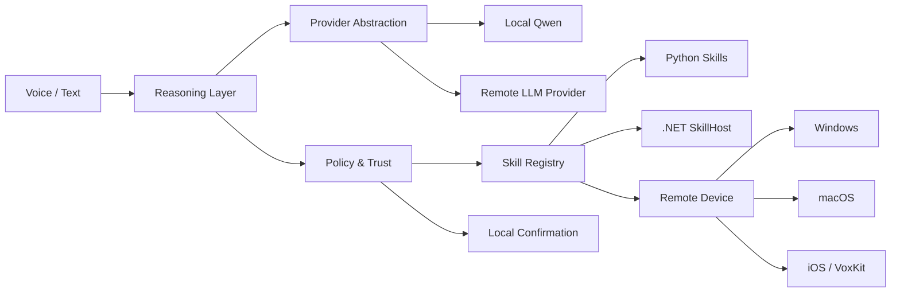

# Vox

**Privacy-first multi-device AI assistant with modular skills, interchangeable LLM providers and secure cross-platform execution.**

Vox is a personal AI systems project focused on voice interaction, tool use and safe execution across multiple devices. The system separates reasoning from execution: models decide *what* should happen, while deterministic policy, trust rules and typed skill contracts decide *whether* and *how* actions may run.

> **Portfolio repository.** This is a curated public snapshot of the project. The original development repository remains private. Source files included here are copied unchanged from the `skill-rework` development branch and selected to show the core architecture.

## Highlights

- Voice/text assistant architecture with local and remote execution
- Provider abstraction for **local Qwen** and remote LLM providers
- Typed, additive **skill registry**
- Explicit capability and risk model
- Local confirmation for sensitive or irreversible actions
- Client/server protocol for remote skill execution
- Cross-platform design for Windows, macOS and iOS
- Python orchestration layer
- Native **Swift VoxKit** protocol/policy implementation
- Modular **.NET SkillHost** and skill contracts
- Fail-closed validation at trust and protocol boundaries

## Architecture

## Design principles

### Reasoning is not authority

The LLM can propose a tool call, but execution is gated by deterministic code. Unknown skills, invalid arguments and unsafe operations fail closed.

### Skills are explicit contracts

Each capability exposes a typed `SkillSpec` describing its arguments, capability set, risk and execution level. Adding a skill is additive: implementation + explicit registration, not changes to a central dispatcher.

### Safety lives at the execution boundary

Sensitive actions require concrete read-back confirmation. Remote devices keep their own policy and allowlist, so a server cannot silently bypass local authorization.

### Provider independence

The reasoning layer is hidden behind provider interfaces so local and remote models can be swapped without coupling skills to a specific SDK.

## Tech stack

| Area | Technologies |
| --- | --- |
| Core orchestration | Python |
| Local / remote reasoning | Qwen, provider abstraction |
| Remote transport | WebSocket / typed protocol |
| Desktop execution | Python adapters, .NET SkillHost |
| Apple client | Swift, SwiftUI, VoxKit |
| Safety | typed capability model, risk levels, local confirmation |
| Testing | pytest, Swift tests, .NET tests |

## Public source snapshot

### Python

- `showcase/python/core/contracts/skills.py` — provider-neutral skill contracts
- `showcase/python/core/trust.py` — risk and capability vocabulary
- `showcase/python/brain/policy.py` — execution policy
- `showcase/python/skills/registry.py` — additive skill registry
- `showcase/python/remote/protocol.py` — client/server wire protocol
- `showcase/python/remote/executor.py` — remote execution pipeline
- `showcase/python/ui/confirmation.py` — explicit confirmation broker

### Swift / Apple

- `showcase/swift/VoxKit/Protocol.swift`
- `showcase/swift/VoxKit/Policy.swift`

These files show the native Apple implementation of the same protocol and safety concepts.

### .NET SkillHost

- `showcase/dotnet/Vox.Contracts/SkillContracts.cs`
- `showcase/dotnet/Vox.SkillHost.Core/SkillExecutor.cs`
- `showcase/dotnet/Vox.SkillHost.Core/SkillRegistry.cs`

The .NET layer demonstrates a separate modular runtime for executing skills behind shared contracts.

## What this project demonstrates

Vox is primarily an **AI systems / agent architecture** project. It demonstrates:

- modular agent/tool architecture
- local LLM integration
- cross-device orchestration
- safety-aware tool execution
- typed protocol design
- multi-runtime interoperability
- cross-platform abstraction
- deterministic control around probabilistic models

Private configuration, tokens, machine-specific setup, model weights, internal planning artifacts and non-essential development files are intentionally excluded.

## Status

Personal project · active development · portfolio showcase.
