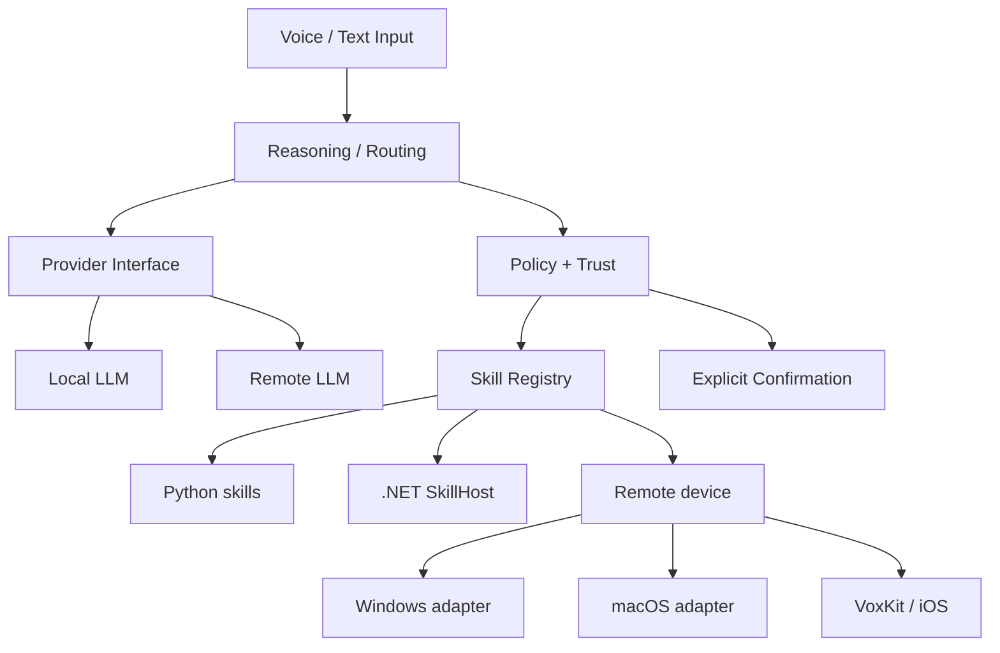

# Architecture

Vox separates **reasoning**, **policy** and **execution** so that an LLM never directly owns the authority to perform actions.

## System overview

## Core contracts

The central abstraction is a provider-neutral `SkillSpec`. A skill declares:

- name and identifier
- typed arguments
- required arguments
- capabilities
- risk level
- execution level

This allows the reasoning layer to discover available actions without depending on the implementation language or target operating system.

## Policy and trust

Execution policy is deterministic.

The trust layer uses a closed capability vocabulary and explicit risk levels. Unknown actions are denied. Sensitive or irreversible actions require a concrete read-back before execution.

For remote execution, policy is enforced on the target device as well. This keeps authorization close to the resource being modified.

## Remote execution

The client/server protocol carries:

- device handshake
- announced skill catalog
- execute requests
- structured results
- audio/control events

The protocol is decoded fail-closed: malformed or unexpected messages do not silently become valid actions.

## Multi-runtime execution

Vox uses multiple implementation layers while preserving the same architectural concepts:

- **Python** for orchestration, skills and remote protocol
- **.NET** for a modular SkillHost and native skill modules
- **Swift / VoxKit** for Apple protocol, policy and execution primitives

## Portfolio scope

Included:
- contracts
- trust/policy logic
- registry/executor logic
- remote protocol
- Swift protocol/policy
- .NET SkillHost core

Excluded:
- private configuration and tokens
- model weights
- machine-specific deployment data
- internal planning artifacts
- generated files and large runtime assets

The public source files are copied unchanged from the private development branch.
